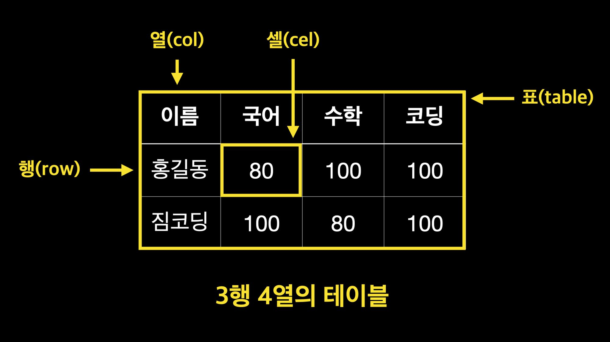

# HTML 기본태그

[GYM CODING NOTION](https://gymcoding.notion.site/HTML-3955c10ca3b040a58c19c458539055a0)

#### ⭐ 키워드 보고 생각 안 나면 링크 들어가서 다시 보기

> - **글꼴 태그** >`h1`~`h6` `p` `hr` `br` `i` `em` `b` `strong`
> - **목록 태그** >`ol` `ul` `li` `dl` `dt` `dd`
> - **표 태그** >`table` `tr` `th` `td`

**[태그 사용 예시]**

```html
<!-- bold -->
<strong>굵게</strong>

<!-- underline -->
<u>밑줄</u>

<!-- heading -->
<h1></h1>
<!-- ... -->
<h6></h6>
...
```

어차피 태그는 다 못외우니까 필요할 때마다 구글링 ㄱㄱ

<br>

## 🎯 이것만은 알고 가자

### 1. Font

같은 역할을 하지만 사용 용도가 다른 친구들

- **`<b>` vs `<strong>`** ➡️ **단순**
- **`<i>` vs `<em>`** ➡️ **강조**

> **`<b>`** 진하게, **`<i>`** 이텔릭체
> **`<strong>`**, **`<em>`** 은 강조할 때 사용
> 용도에 맞게 사용하면 웹 접근성에 큰 기여를 함!

<br>

### 2. List

**특히 많이 쓰는 태그**

- **`<ul>`** `Unordered Lists` 순서가 없는 목록
- **`<dl>`** `Definition List `사전처럼 용어를 설명하는 목록
- **`<dt>`** `Definition Term` 정의되는 용어의 제목
- **`<dd>`** `Definition Description` 용어를 설명
  > `dl`, `dt`, `dd`는 사전처럼 정의할 때 많이 씀

**주의할 점**

- `<dl>`태그 안에는 `<dt>`, `<dd>` 각각 하나 이상의 태그 필수로 가짐

  ```html
  <dl>
    <dt>종류</dt>
    <dt></dt>
    <dd>벤치프레스</dd>
    <dd></dd>
    <dd>(가슴운동)</dd>
    <dd></dd>
  </dl>

  <dl>
    <dt>벤치프레스</dt>
    <dt></dt>
    <dt>(가슴운동)</dt>
    <dt></dt>
    <dd>헬스의 3대 운동중 하나도 가슴 부위를 발달 시키는 운동이다.</dd>
    <dd></dd>
  </dl>
  ```

<br>

### 3. Table



- `<th>`와 `<td>`는 `<tr>`의 자식태그로 반드시 `<tr>` 태그 안에 있어야 함

#### `<table border>`

- table 태그에는 border라는 테두리 속성이 존재하지만, 웹 표준이 아님 ➡️ 웹에서 권고하는 사항 ➡️ 웹 표준을 준수하면 좋다 ! 라고 알고 있자.

#### `<col width="40px" />`

- 웹 표준에 어긋남 ➡️ class 사용

#### 셀 병합

- 병합하고 싶은 셀의 첫 번째 셀에서 **행**`<rowspan="2">` 또는 **열**`<colspan="병합할 셀 수">` 추가하고 첫 번째 셀 내용만 남겨놓고 나머지 셀의 내용은 지워주기
- `<thead>` `<tbody>` `<tfoot>` 각각의 태그에서만 병합 가능
- 만약 `<tbody>`에서 `<rowspan="4">`를 해도 밑의 `<tfoot>`태그 안의 '평균'행은 병합이 되지 않음

---

</table>
    <h1>Table 그룹 태그</h1>
    <table>
      <caption>
        학급점수
      </caption>
      <colgroup>
        <col class="col1" />
        <col class="col2" />
        <col class="col3" />
        <col class="col4" />
        <col class="col5" />
        <col class="col6" />
      </colgroup>
      <thead>
        <tr>
          <th>반</th>
          <th>이름</th>
          <th>국어</th>
          <th>영어</th>
          <th>수학</th>
          <th>코딩</th>
        </tr>
      </thead>
      <tbody>
        <tr>
          <td rowspan="2">1반</td>
          <td>홍길동</td>
          <td>90</td>
          <td>100</td>
          <td>90</td>
          <td>81</td>
        </tr>
        <tr>
          <td>콩순이</td>
          <td>85</td>
          <td>81</td>
          <td>95</td>
          <td>100</td>
        </tr>
      </tbody>
      <tfoot>
        <tr>
          <td>1반</td>
          <td>평균</td>
          <td>87.5</td>
          <td>90.5</td>
          <td>92.5</td>
          <td>90.5</td>
        </tr>
      </tfoot>
    </table>

> 홍길동 콩순이의 반이 1반으로 병합된 것 확인할 수 있음

<details>
  <summary>테이블 병합 코드</summary>

```html
</table>
    <h1>Table 그룹 태그</h1>
    <table>
      <caption>
        학급점수
      </caption>
      <colgroup>
        <col class="col1" />
        <col class="col2" />
        <col class="col3" />
        <col class="col4" />
        <col class="col5" />
        <col class="col6" />
      </colgroup>
      <thead>
        <tr>
          <th>반</th>
          <th>이름</th>
          <th>국어</th>
          <th>영어</th>
          <th>수학</th>
          <th>코딩</th>
        </tr>
      </thead>
      <tbody>
        <tr>
          <td rowspan="2">1반</td>
          <td>홍길동</td>
          <td>90</td>
          <td>100</td>
          <td>90</td>
          <td>81</td>
        </tr>
        <tr>
          <td>콩순이</td>
          <td>85</td>
          <td>81</td>
          <td>95</td>
          <td>100</td>
        </tr>
      </tbody>
      <tfoot>
        <tr>
          <td>1반</td>
          <td>평균</td>
          <td>87.5</td>
          <td>90.5</td>
          <td>92.5</td>
          <td>90.5</td>
        </tr>
      </tfoot>
    </table>
```

</details>

---

<br>

#### 💡개꿀 단축키

- multi select
  - ctrl + alt + 방향키
  - cmd + option
- 반복 태그
  - `ul>li*3` 후에 탭키로 다음 리스트 작성 가능
