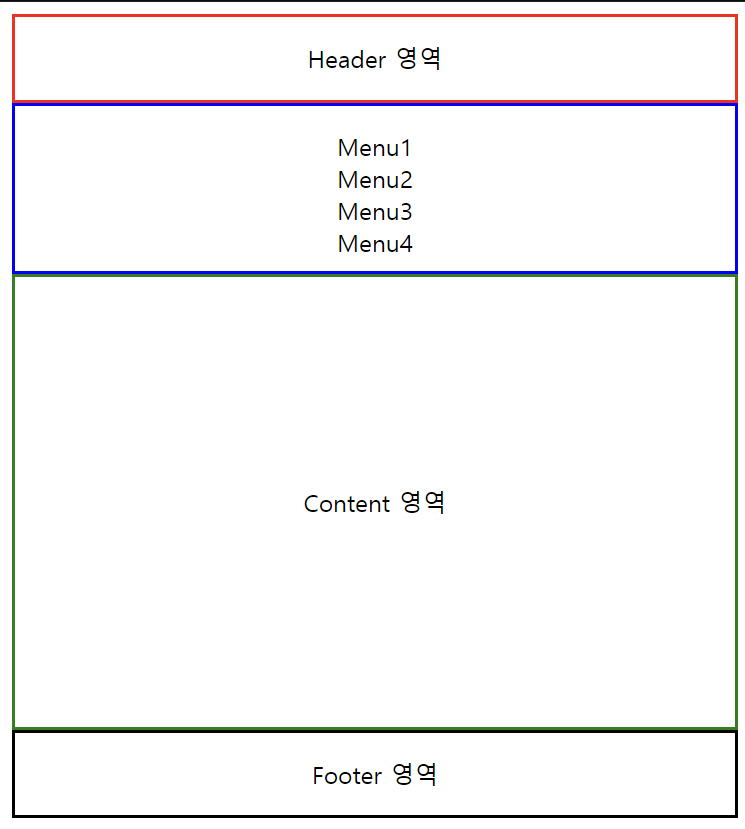
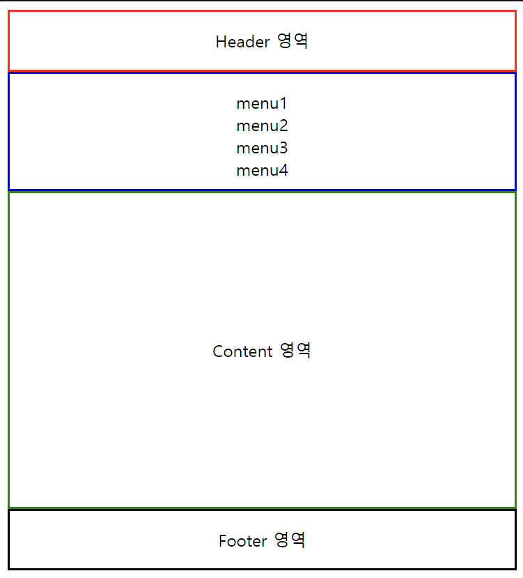

> ### Semantic = 의미론적

<br>

## 1. Semantic 태그 이점

- 검색엔진 최적화
- 웹 접근성 향상
- 가독성 향상

<br>

## 2. HTML Semantic 요소

[MDN docs - Semantics](https://developer.mozilla.org/ko/docs/Glossary/Semantics)

| 태그           | 설명                                                                                                          |
| -------------- | ------------------------------------------------------------------------------------------------------------- |
| `<header>`     | 페이지에 대한 정보를 담는 태그, 페이지 상단에 위치                                                            |
| `<nav>`        | 다른 페이지나 같은 페이지 안에 다른 부분으로 이어주는 내비게이션 링크로 구성된 섹션                           |
| `<aside>`      | 주요 내용과는 직접적인 연관성은 없는 분리된 내용                                                              |
| `<main>`       | 문서의 body 요소의 주 콘텐츠(main content) 정의                                                               |
| `<section>`    | 문서나 응용프로그램의 일반적인 섹션 표현                                                                      |
| `<article>`    | 여러가지 아이템들을 묶어 재사용 가능하게 그룹화                                                               |
| `<footer>`     | 저작권 정보나 서비스 제공자 정보 등, 사이트 하단에 위치                                                       |
| `<details>`    | 추가적인 정보를 나타내거나 사용자가 요청하는 정보를 나타냄                                                    |
| `<summary>`    | 부모요소인 details 요소의 내용에 대한 요약이나 캡션 등                                                        |
| `<figcaption>` | 부모요소인 figure 요소의 내용들에 대한 캡션, 혹은 제목                                                        |
| `<figure>`     | 일러스트, 다이어그램, 사진, 코드 등에 주석 달기                                                               |
| `<mark>`       | 하나의 문서 내에서 다른 문맥과의 관련성을 나타내기 위해서 참조 목적으로 마킹되거나 하이라이트된 텍스트를 표현 |
| `<time>`       | 24시간에서의 시간 혹은 그레고리력에서의 정밀한 날짜                                                           |

```html
<!--단축키 `.` + `Enter`-->
<div class=""></div>
```

<br>

## 3. style 적용 차이 확인 ⭐

#### 시맨틱 ❌

```html
<!DOCTYPE html>
<html lang="en">
  <head>
    <meta charset="UTF-8" />
    <meta name="viewport" content="width=device-width, initial-scale=1.0" />
    <title>Non Semantic</title>
    <style>
      * {
        text-align: center;
      }
      .header {
        border: 2px solid red;
        line-height: 55px;
        height: 55px;
      }
      .nav {
        border: 2px solid blue;
        height: 110px;
      }
      .main {
        border: 2px solid green;
        height: 300px;
        line-height: 300px;
      }
      .footer {
        border: 2px solid black;
        height: 55px;
        line-height: 55px;
      }
      ul {
        list-style: none;
        padding-left: 0px;
      }
    </style>
  </head>
  <body>
    <div class="header">Header 영역</div>
    <div class="nav">
      <ul>
        <li>Menu1</li>
        <li>Menu2</li>
        <li>Menu3</li>
        <li>Menu4</li>
      </ul>
    </div>
    <div class="main">Content 영역</div>
    <div class="footer">Footer 영역</div>
  </body>
</html>
```



<br>

#### 시맨틱 ⭕

```html
<!DOCTYPE html>
<html lang="en">
  <head>
    <meta charset="UTF-8" />
    <meta name="viewport" content="width=device-width, initial-scale=1.0" />
    <title>Semantic</title>
    <style>
      * {
        text-align: center;
      }
      header {
        border: 2px solid red;
        line-height: 55px;
        height: 55px;
      }
      nav {
        border: 2px solid blue;
        height: 110px;
      }
      main {
        border: 2px solid green;
        height: 300px;
        line-height: 300px;
      }
      footer {
        border: 2px solid black;
        height: 55px;
        line-height: 55px;
      }
      ul {
        list-style: none;
        padding-left: 0px;
      }
    </style>
  </head>
  <body>
    <header>Header 영역</header>
    <nav>
      <ul>
        <li>menu1</li>
        <li>menu2</li>
        <li>menu3</li>
        <li>menu4</li>
      </ul>
    </nav>
    <main>Content 영역</main>
    <footer>Footer 영역</footer>
  </body>
</html>
```



출력은 동일하게 되지만, 지금 이 요소 부분에서 차이가 있다.

```html
<!--None_Semantic-->

<body>
  <div class="header">Header 영역</div>
  <div class="nav">
    <ul>
      <li>Menu1</li>
      <li>Menu2</li>
      <li>Menu3</li>
      <li>Menu4</li>
    </ul>
  </div>
  <div class="main">Content 영역</div>
  <div class="footer">Footer 영역</div>
</body>
```

```html
<!--Semantic-->

<body>
  <header>Header 영역</header>
  <nav>
    <ul>
      <li>menu1</li>
      <li>menu2</li>
      <li>menu3</li>
      <li>menu4</li>
    </ul>
  </nav>
  <main>Content 영역</main>
  <footer>Footer 영역</footer>
</body>
```

<br>

> **💡 시맨틱 HTML의 장점**

- `<header>`, `<nav>`, `<main>`, `<footer>` 요소를 사용해 코드의 가독성 향상
- 클래스 이름에만 의존하지 않고도 각 섹션의 구조와 목적 이해 가능
- 유지보수 용이한 쉬운 코드
