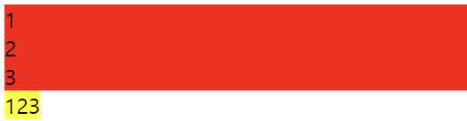
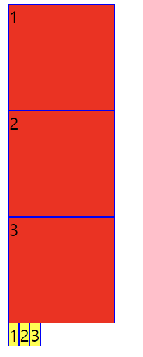

# Default Display Value

- 각 HTML 태그들이 용도에 따라 갖는 기본 표시 값
- 블록 레벨 요소(Block-level Elements)와 인라인 레벨 요소(Inline-level Elements)로 나뉨

> div, span 외 Block/Inline-level 요소들 외우려고 하지 말고 쓰면서 익히기
> [GYM CODING NOTION
> ](https://gymcoding.notion.site/Inline-VS-Block-Element-362ac27ec2e5440eb6eebeb8cec53348)

### `<div>` 中 Block-level

- Division 분할, 분배, 분류
- 영역태그, 컨테이너
- 태그를 담는 컨테이너 역할

### `<span>` 中 Inline-level

- Span 범위, 영역
- 영역태그, 특정아이템
- `<div>`와 달리 컨테이너보다는 영역을 의미

---


- `<div>` 블록 전체를 의미 🔴
- `<span>` 컨텐츠만을 의미 🟡

<br>

## Block-level vs Inline-level

---

### 1. 표기 방식

- `Block-level Elements`는 새로운 블록을 형성해 세로로 표시
- `Inline-level Elements`는 요소 사이에 줄 바꿈 없이 가로로 나열되어 표시



```html
<!-- Block-level의 div태그는 세로로 표시 -->
<div>1</div>
<div>2</div>
<div>3</div>

<!-- Inline-level의 span태그는 가로로 표시 -->
<span>1</span><span>2</span><span>3</span>
```

<br>

### 2. 레이아웃

- style에 너비와 높이의 픽셀값을 추가해 차이를 확인
- Inline-level의 span태그는 테두리는 style 적용이 되었지만, 가로세로 크기는 변경이 되지 않았음

> 즉, `Block-level`은 CSS를 사용해 가로세로 크기를 조절할 수 있고 `Inline-level`은 조절할 수 없다.



```html
<!DOCTYPE html>
<html lang="en">
  <head>
    <meta charset="UTF-8" />
    <meta name="viewport" content="width=device-width, initial-scale=1.0" />
    <title>Document</title>
    <style>
      div {
        background-color: red;
        width: 100px;
        height: 100px;
        border: 1px solid blue;
      }
      span {
        background-color: yellow;
        width: 100px;
        height: 100px;
        border: 1px solid blue;
      }
    </style>
  </head>
  <body>
    <div>1</div>
    <div>2</div>
    <div>3</div>
    <span>1</span><span>2</span><span>3</span>
  </body>
</html>
```

> style을 변경했을 때 블록레벨 요소는 가로세로 크기 조정 가능 인라인은 가로세로 크기 조정 불가능

<br>

## CSS Display 속성

---

- 블록레벨 인라인레벨 서로 변경 가능
- CSS default display value가 `block` 이면 해당 태그는 블록 요소이고, `inline` 이면 인라인 요소
- style에서 `display: inline;` 을 적용하면 블럭을 인라인으로
- style에서 `display: block;` 을 적용하면 인라인을 블럭으로 변경할 수 있다.

```css
/* 인라인 요소로 변경 */

div {
  display: inline;
}
```

<br>

## B vs I 요약

---

### Block-level Elements

- 부모 요소의 **전체 공간**을 차지하여 "블록"을 만듦
- 한 칸 모두 차지, `세로`로 나열
- 화면 구성, 레이아웃
- `width`, `height`, `margin` 속성이 적용됨
- `<h1>~<h6>` `<ol>` `<ul>` `<li>` `<p>` 태그 등

<br>

### Inline-level Elements

- 콘텐츠의 흐름을 끊지 않고(`줄 바꿈 X`), 요소를 구성하는 **태그에 할당된 공간만 차지**
- 콘텐츠 영역만큼 차지, `가로`로 나열
- margin-top, margin-bottom 적용❌. 대신에 `line-height` 이용
- width, height 속성 적용❌.
- 태그가 콘텐츠의 할당된 공간만 갖고 있기 때문에 text-align과 같은 속성은 사용❌
- `<a>` `<em>` `` `<span>` 태그 등

---

💡

- Block/Inline-level Elements를 하나하나 외우기 보다는 살펴보면서 아 이건 이거구나 하며 알아가기
- 특성은 미리 알아두고 배치 시 적용하기
