# Form 태그

---

- 사용자의 데이터를 입력받는 양식

```html
<!DOCTYPE html>
<html lang="en">
  <head>
    <meta charset="UTF-8" />
    <meta name="viewport" content="width=device-width, initial-scale=1.0" />
    <title>Form 1</title>
  </head>
  <body>
    <form action="">
      <div>
        <label for="username">아이디</label>
        <input type="text" id="username" />
      </div>
      <div>
        <label for="password">비밀번호</label>
        <input type="password" id="password" />
      </div>
      <input type="submit" value="제출하기" />
    </form>
  </body>
</html>
```

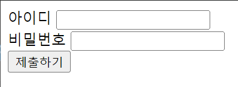

<br>
<br>

## Form 데이터 태그 속성

- `required` 입력값 필수
- `readonly` 읽기 전용 필드로 전환(값 수정 불가) (서버로 전송 됨)
- `disabled` 데이터 비활성화(값 수정 불가) (서버로 전송되지 않음)
- `autofocus` 초기 해당 필드에 커서 위치
- `placeholder` 입력 필드가 비어있을 때 해당 입력값의 설명 또는 가이드 문구를 삽입

**required** 를 쓰면 요렇게 필수값이 됨(값 입력 필수)

```html
<label for="text">Text</label> <input type="text" id="text" required />
```

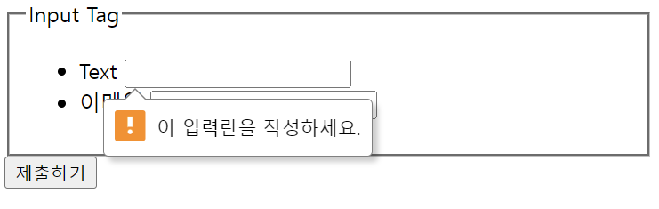

UI에서 **readonly**와 **disabled**의 차이
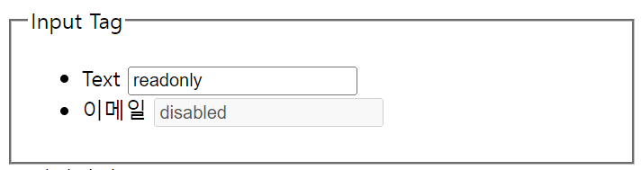

url에 **placeholder** 사용
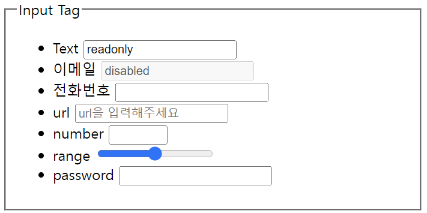

<br>
<br>

# Fieldset 태그

---

데이터 그룹화 기능

```html
<!DOCTYPE html>
<html lang="en">
  <head>
    <meta charset="UTF-8" />
    <meta name="viewport" content="width=device-width, initial-scale=1.0" />
    <title>Form Input</title>
  </head>
  <body>
    <form action="">
      <fieldset>
        <legend>개인정보</legend>
        <input type="text" />
        <input type="text" />
      </fieldset>
      <fieldset>
        <legend>사업자정보</legend>
        <input type="text" />
        <input type="text" />
      </fieldset>

      <input type="text" />
      <input type="text" />
    </form>
  </body>
</html>
```

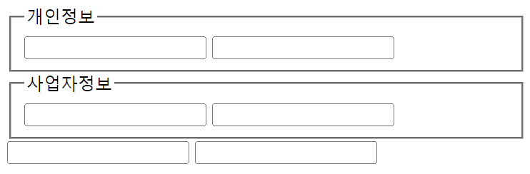

<br>
<br>

# Input 태그

---

## ✔️ text

`<input>` 태그의 기본 타입 값으로 일반 텍스트를 받음

```html
<input type="text" id="name" />
```

- text 외 다양한 타입 존재(HTML5)
- [MDN `<input>`](https://developer.mozilla.org/en-US/docs/Web/HTML/Element/input)에서 type 확인 가능

<br>

## ✔️ hidden

`name=""` 이름을 갖는 `value` 안의 값을 전달

- 서버 측으로 어떠한 데이터를 넘길 때 사용
- UI 상에서는 표시되지 않음

```html
<input type="hidden" name="" value="" />
```

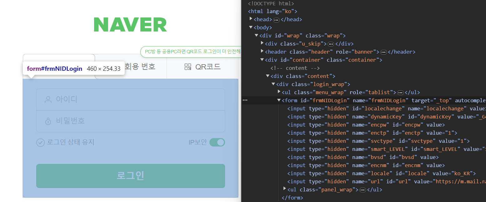

> 네이버 로그인 창의 개발자 도구(F12)로 form 태그를 확인했을 때, input 태그에 여러 hidden 타입이 있음을 확인할 수 있음
>
> "localchange" 이름을 갖는 value 안의 값을 전달

<br>

## ✔️ file

제출할 파일 선택 기능

```html
<input type="file" multiple />
```

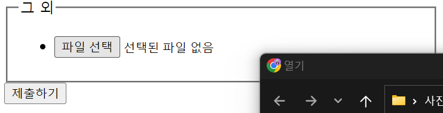

<br>
<br>

# Label 태그 `웹 접근성 준수`

---

## ✔️ email

email 주소 데이터 받음(이메일 유효성 검증)

```html
<label for="email">이메일</label> <input type="email" id="email" required />
```

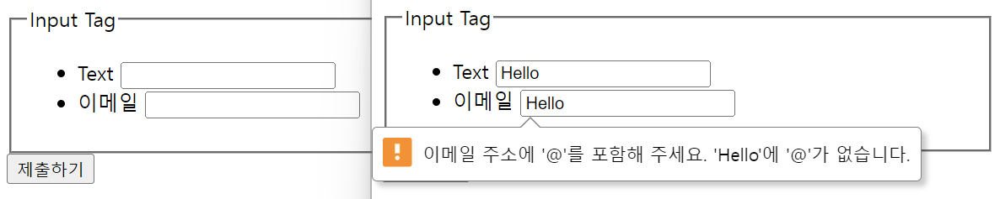

<br>

## ✔️ tel

모바일로 전화번호 칸 터치하면 숫자 키패드가 올라옴

```html
<label for="tel">전화번호</label> <input type="tel" id="tel" required />
```

<br>

## ✔️ url

url 유효성 검증

```html
<label for="url">url</label>
<input type="url" id="url" required placeholder="url을 입력해주세요" />
```

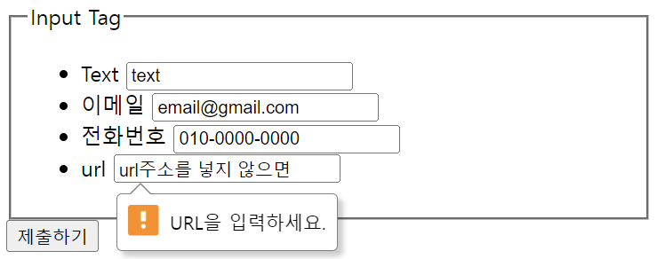

<br>

## ✔️ number

min과 max 값을 설정하면 입력 값을 자동으로 유효성 검사
범위 안에 들어가지 않으면 오류 메시지

```html
<label for="number">number</label>
<input type="number" id="number" required min="5" max="10" />
```

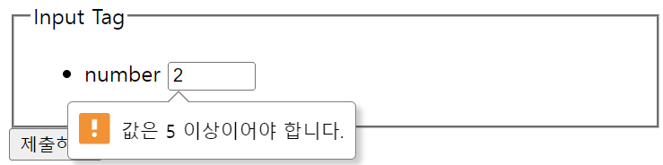

<br>

## ✔️ range

```html
<label for="range">range</label> <input type="range" id="range" required />
```

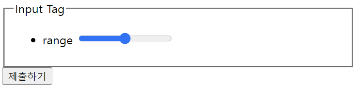

<br>

## ✔️ date

선택 가능한 날짜 범위 설정 가능

```html
<label for="date">date</label>
<input type="date" id="date" min="2023-12-18" max="2023-12-31" />
```


- 18~31 선택할 수 있는 범위가 지정된 것을 확인할 수 있음

<br>

## ✔️ time

시간 범위 설정하면 선택은 가능하지만, email처럼 제출 시 **유효성 체크**

```html
<label for="time">time</label>
<input type="time" id="time" min="09:00" max="18:00" />
```

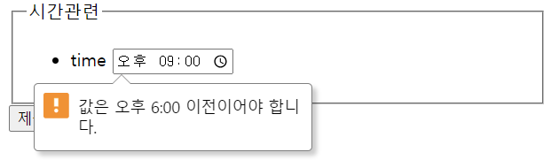

<br>

## ✔️ password

●●●● 마스킹 처리 되어 표시

```html
<label for="password">password</label>
<input type="password" id="password" required />
```

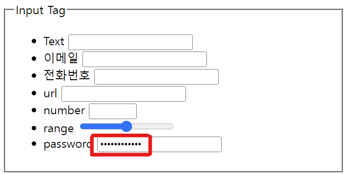

<br>

## ✔️ checkbox

다중 선택 가능한 체크박스

```html
<form action="">
  <fieldset>
    <legend>좋아하는 색상을 모두 선택해주세요.</legend>
    <ul>
      <li>
        <label for="red">빨강</label>
        <input type="checkbox" id="red" value="red" />
      </li>
      <li>
        <label for="orange">주황</label>
        <input type="checkbox" id="red" value="orange" />
      </li>
      <li>
        <label for="yellow">노랑</label>
        <input type="checkbox" id="red" value="yellow" />
      </li>
      <li>
        <label for="green">초록</label>
        <input type="checkbox" id="red" value="green" />
      </li>
      <li>
        <label for="blue">파랑</label>
        <input type="checkbox" id="red" value="blue" />
      </li>
    </ul>
  </fieldset>
</form>
```

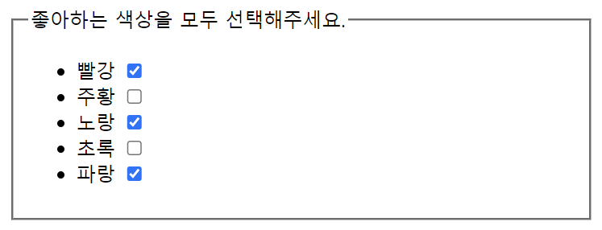

<br>

## ✔️ radio

하나만 선택 가능한 라디오 버튼
name을 같은 name으로 묶으면 중복 선택이 되지 않음
name을 기재하지 않을 시 중복 선택이 가능해짐

```html
<fieldset>
  <legend>배송방법은?</legend>
  <ul>
    <li>
      <label for="free">무료</label>
      <input type="radio" name="delivery" id="free" value="free" />
    </li>
    <li>
      <label for="pay">유료</label>
      <input type="radio" name="delivery" id="pay" value="pay" />
    </li>
  </ul>
</fieldset>
```

> #### ⭐ checkbox에서 radio처럼 name으로 그룹화하면 ⭐
>
> 그럼 체크박스를 쓸 때도 name으로 그룹화가 가능할까해서 색상에 적용해 봤는데
> name을 color로 묶어줬음에도 중복 선택이 가능했음>\>
> 즉.. 라디오버튼은 체크박스처럼 중복 선택이 가능하게 만들 수 있어도 **체크박스는 단일 선택으로 만들 수 없었음**

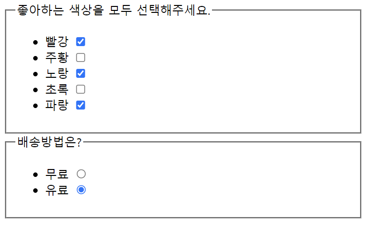

<br>

ChatGPT에게 물어봤다..👍🏻

> **라디오버튼 (Radio Buttons)**
> 라디오버튼은 여러 옵션 중 하나를 선택하는데 사용됩니다.
> 같은 "name" 속성 값을 가지는 라디오버튼들은 하나의 그룹으로 간주되며, 이 그룹 내에서는 하나의 라디오버튼만 선택될 수 있습니다. 즉, 중복 선택이 불가능합니다.
>
> **체크박스 (Checkboxes)**
> 체크박스는 여러 옵션을 독립적으로 선택 또는 해제할 수 있습니다.
> 각 체크박스는 독립적이므로 "name" 속성 값이 같아도 서로 다른 옵션 간에 중복 선택이 가능합니다.
>
> 따라서 체크박스를 사용할 때는 동일한 "name" 속성 값으로 여러 옵션을 그룹화하여도 각 체크박스는 독립적으로 동작하게 됩니다. 중복 선택이 가능합니다. _만약 단일 선택이 필요하다면, 라디오버튼을 사용해야 합니다._

<br>
<br>

# Textarea

---

여러 줄의 데이터를 입력 받을 수 있음
`<cols>` 행 수 지정
`<rows>` 열 수 지정

```html
<fieldset>
  <legend>자기소개서</legend>
  <textarea name="" id="" cols="30" rows="10">
textarea는 default값을 value가 아닌 컨텐츠 안에 작성</textarea
  >

  <textarea name="" id="" cols="15" rows="5">
12345678901234567890
2
3
4
5
6
7
  </textarea>
</fieldset>
```

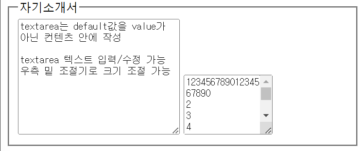


<br>
<br>

# Select

---

서버에 value 값을 전달
`사과10kg`이 아니라 `apple_10kg`이 전달 됨

```html
<fieldset>
  <legend>주문 상품을 선택해주세요!</legend>
  <ul>
    <li>
      <select name="goods" id="goods">
        <option value="apple_10kg">사과10kg</option>
        <option value="apple_20kg">사과20kg</option>
        <option value="apple_30kg">사과30kg</option>
        <option value="apple_40kg">사과40kg</option>
        <option value="apple_50kg">사과50kg</option>
      </select>
    </li>
  </ul>
</fieldset>
```

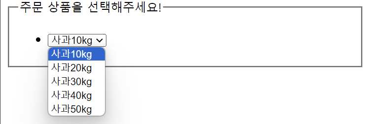

**selected**
default 값을 지정하고 싶을 때는 value 뒤 selected를 작성
예를 들어 사과20kg을 선택 목록에 표시하고 싶을 때 이렇게 작성하면

```html
<option value="apple_20kg" selected>사과20kg</option>
```

20kg이 기본값으로 표시된다 !

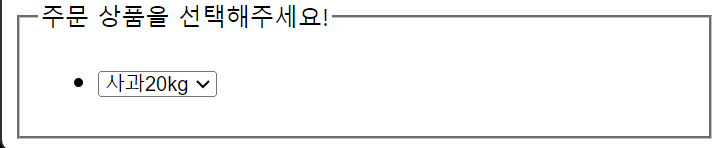

**multiple**
다중 선택을 하고 싶으면 multiple을 추가하면 됨

```html
<select name="goods" id="goods" multiple>
  <option value="apple_10kg">사과10kg</option>
  <option value="apple_20kg" selected>사과20kg</option>
  <option value="apple_30kg">사과30kg</option>
  <option value="apple_40kg">사과40kg</option>
  <option value="apple_50kg">사과50kg</option>
</select>
```

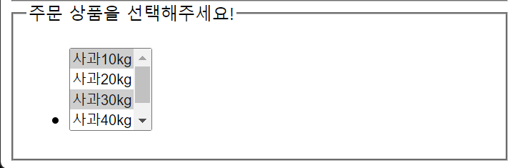

<br>
<br>

# Datalist

---

```html
<label for="ice-cream-choice">맛을 선택하세요</label>
<input list="ice-cream-flavors" id="ice-cream-choice" name="ice-cream-choice" />
<datalist id="ice-cream-flavors">
  <option value="Chocolate"></option>
  <option value="Coconut"></option>
  <option value="Mint"></option>
  <option value="Strawberry"></option>
  <option value="Vanilla"></option>
</datalist>
```

`select`랑 다른 느낌의 목록인데 보통 우리가 이메일이나 이름 전화번호 입력할 때 입력했던 정보들이 주르륵 뜨는 그런 느낌의 타입

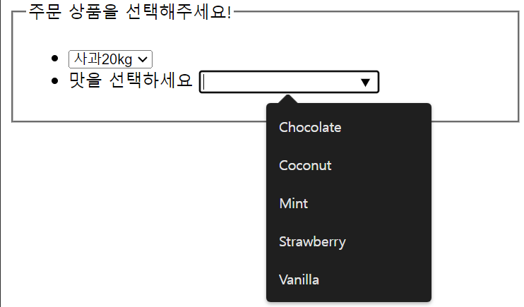

input 태그가 있어 입력이 가능한데,
칸에 값을 입력하면 포함되는 단어가 밑에 리스트로 나타남
약간 자동완성 기능 느낌임 !

<br>
<br>

# Button

---

클릭 가능한 버튼으로, 어디든 배치 가능

```html
<button>제출하기</button> <button type="reset">리셋하기</button>
```

<br>

## ✔️ submit

`action`에 지정한 url주소로 양식(`form`)을 제출 (기본값)

```html
<form action="url주소"></form>
```

```html
<button>제출하기</button>
```

<br>

## ✔️ reset

모든 입력 필드를 초기값으로 되돌림

```html
<button type="reset">리셋하기</button>
```

<br>

## ✔️ button

자바스크립트 코드 명령 실행
onclick을 사용해 메시지 띄우기 가능 !

```html
<button type="button" onclick="alert('Hello~~~world')">버튼</button>
```

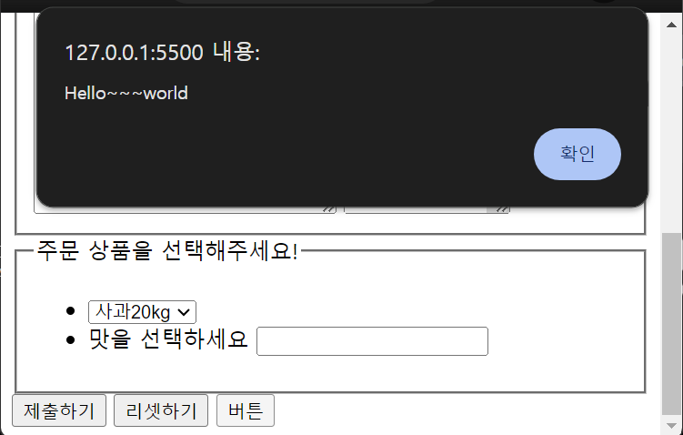

---
