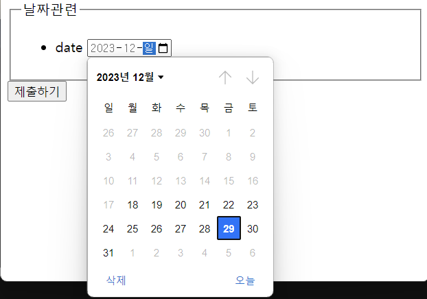

# Form 태그

---

- 사용자의 데이터를 입력받는 양식

```html
<!DOCTYPE html>
<html lang="en">
  <head>
    <meta charset="UTF-8" />
    <meta name="viewport" content="width=device-width, initial-scale=1.0" />
    <title>Form 1</title>
  </head>
  <body>
    <form action="">
      <div>
        <label for="username">아이디</label>
        <input type="text" id="username" />
      </div>
      <div>
        <label for="password">비밀번호</label>
        <input type="password" id="password" />
      </div>
      <input type="submit" value="제출하기" />
    </form>
  </body>
</html>
```


<br>
<br>

# Fieldset 태그

---

데이터 그룹화 기능

```html
<!DOCTYPE html>
<html lang="en">
  <head>
    <meta charset="UTF-8" />
    <meta name="viewport" content="width=device-width, initial-scale=1.0" />
    <title>Form Input</title>
  </head>
  <body>
    <form action="">
      <fieldset>
        <legend>개인정보</legend>
        <input type="text" />
        <input type="text" />
      </fieldset>
      <fieldset>
        <legend>사업자정보</legend>
        <input type="text" />
        <input type="text" />
      </fieldset>

      <input type="text" />
      <input type="text" />
    </form>
  </body>
</html>
```


<br>
<br>

# Input 태그

---

## ✔️ text

`<input>` 태그의 기본 타입 값으로 일반 텍스트를 받음

```html
<input type="text" id="name" />
```

- text 외 다양한 타입 존재(HTML5)
- [MDN `<input>`](https://developer.mozilla.org/en-US/docs/Web/HTML/Element/input)에서 type 확인 가능

<br>

### ✔️ hidden

`name=""` 이름을 갖는 `value` 안의 값을 전달

- 서버 측으로 어떠한 데이터를 넘길 때 사용
- UI 상에서는 표시되지 않음

```html
<input type="hidden" name="" value="" />
```


> 네이버 로그인 창의 개발자 도구(F12)로 form 태그를 확인했을 때, input 태그에 여러 hidden 타입이 있음을 확인할 수 있음
>
> "localchange" 이름을 갖는 value 안의 값을 전달

<br>

### ✔️ file

제출할 파일 선택 기능

```html
<input type="file" multiple />
```


<br>
<br>

# label 태그 `웹 접근성 준수`

---

## ✔️ email

email 주소 데이터 받음(이메일 유효성 검증)

```html
<label for="email">이메일</label> <input type="email" id="email" required />
```


<br>

**required** 를 쓰면 요렇게 필수값이 됨(값 입력 필수)

```html
<label for="text">Text</label> <input type="text" id="text" required />
```


<br>

## ✔️ tel

모바일로 전화번호 칸 터치하면 숫자 키패드가 올라옴

```html
<label for="tel">전화번호</label> <input type="tel" id="tel" required />
```

<br>

## ✔️ url

url 유효성 검증

```html
<label for="url">url</label> <input type="url" id="url" required />
```


<br>

## ✔️ number

min과 max 값을 설정하면 입력 값을 자동으로 유효성 검사
범위 안에 들어가지 않으면 오류 메시지

```html
<label for="number">number</label>
<input type="number" id="number" required min="5" max="10" />
```


<br>

## ✔️ range

```html
<label for="range">range</label> <input type="range" id="range" required />
```


<br>

## ✔️ date

선택 가능한 날짜 범위 설정 가능

```html
<label for="date">date</label>
<input type="date" id="date" min="2023-12-18" max="2023-12-31" />
```



- 18~31 선택할 수 있는 범위가 지정된 것을 확인할 수 있음

<br>

## ✔️ time

시간 범위 설정하면 선택은 가능하지만, email처럼 제출 시 **유효성 체크**

```html
<label for="time">time</label>
<input type="time" id="time" min="09:00" max="18:00" />
```


<br>

## ✔️ password

●●●● 마스킹 처리 되어 표시

```html
<label for="password">password</label>
<input type="password" id="password" required />
```


<br>

---
