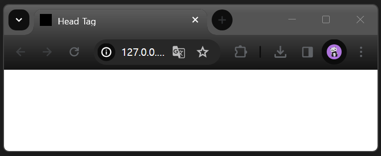

# Head 태그

---

문서정보(메타데이터)를 담고 있음
head 안에 배치할 수 있는 요소들을 살펴 보자 ~

<br>

## ✔️ link

[Favicon 사이트](https://www.degraeve.com/favicon/index.php?pixels=000000000000000000000000000000000000000000000000000000000000000000000000000000000000000000000000000000000000000000000000000000000000000000000000000000000000000000000000000000000000000000000000000000000000000000000000000000000000000000000000000000000000000000000000000000000000000000000000000000000000000000000000000000000000000000000000000000000000000000000000000000000000000000000000000000000000000000000000000000000000000000000000000000000000000000000000000000000000000000000000000000000000000000000000000000000000000000000000000000000000000000000000000000000000000000000000000000000000000000000000000000000000000000000000000000000000000000000000000000000000000000000000000000000000000000000000000000000000000000000000000000000000000000000000000000000000000000000000)

```html
<link rel="shortcut icon" href="../image/favicon.ico" />
```

짠~~~ 요렇게 탭 아이콘이 바뀜!


<br>

## ✔️ Base

기존 favicon 경로는

```html
<link rel="shortcut icon" href="../image/favicon.ico" />
```

base 태그를 사용해 기준 경로를 변경하면

```html
<base href="/GYM-CODING/image/" />
<link rel="shortcut icon" href="./favicon.ico" />
```

상위 폴더의 image로 설정했던 파일 경로를 이렇게 현재 경로로 바꿀 수 있음

<br>

## ✔️ Style

css할 때 많이 쓸 것 같다!

<br>

## ✔️ Meta

`<base>`, `<link>`, `<script>`, `<style>`, `<title>` 같은
다른 메타관련 요소로 나타낼 수 없는 메타데이터

```html
<meta property="og:image" content="https://example.com/image.jpg" />
```

<br>

## ✔️ Script

데이터나 자바스크립트 코드를 웹 문서에 포함

```html
<script src="javascript.js"></script>
```

<br>
<br>

# Open Graph 오픈 그래프

---

콘텐츠의 요약내용이 SNS에 게시되는데 최적화된 데이터를 가지고 갈 수 있도록 설정!

```html
<!--기본적으로 웹에 설정해야 하는 og 메타태그-->
<meta property="og:type" content="website" />
<meta property="og:url" content="https://example.com/page.html" />
<meta property="og:title" content="Content Title" />
<meta property="og:image" content="https://example.com/image.jpg" />
<meta property="og:description" content="Description Here" />
<meta property="og:site_name" content="Site Name" />
<meta property="og:locale" content="en_US" />

<!-- 다음의 태그는 필수는 아니지만, 포함하는 것을 추천함 -->
<meta property="og:image:width" content="1200" />
<meta property="og:image:height" content="630" />
```

<br>
<br>

> 그냥 이렇게 봐서는 확 와닿지 않는다 ! ! !
> 실습 프로젝트를 해 봐야 익숙해질 것 같다.
