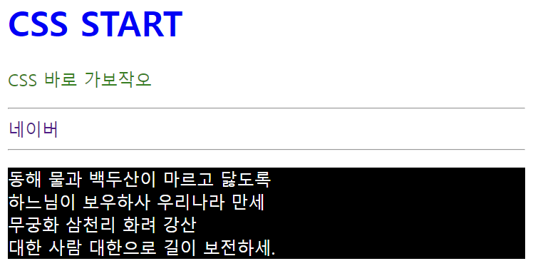
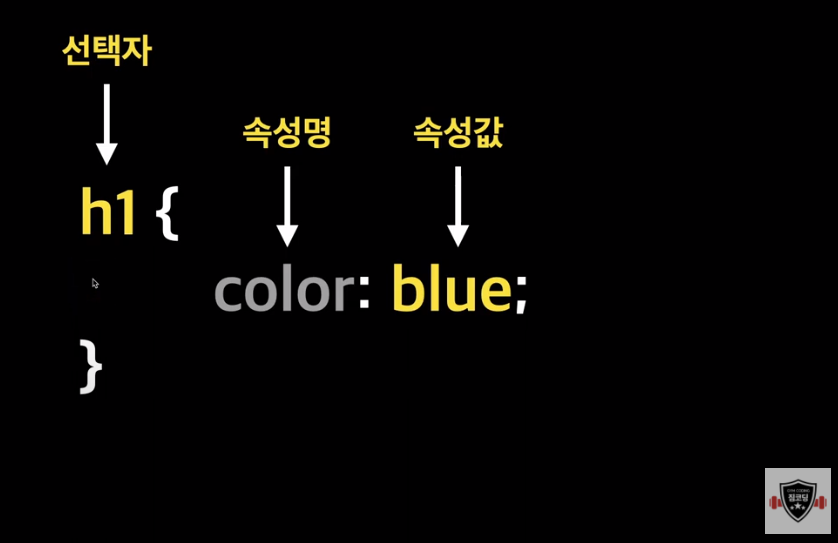
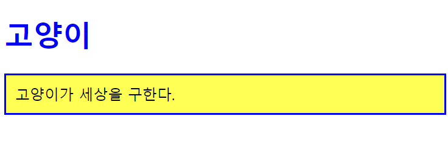

# CSS

---

**C**ascading **S**tyle **S**heets
html의 문서를 꾸밀 때 사용하는 style sheet 언어
html로 뼈대를 만들고 css를 태그에 적용해 꾸미는 것

<br>

## Style

이렇게 태그 안에 컬러 지정을 할 수 있고,

```html
<h1 style="color: blue">CSS START</h1>
```

이렇게 head 태그의 style 태그에서 미리 만들어두고 사용할 수도 있다.

```html
<title>CSS</title>
<style>
  .green--text {
    color: green;
  }
  .text-decoration-none {
    text-decoration: none;
  }
  #dark {
    background-color: black;
    color: white;
  }
</style>
```

```html
<p class="green--text">CSS 바로 가보작오</p>
<a class="text-decoration-none" href="https://naver.com/">네이버</a>
<p id="dark">
  동해 물과 백두산이 마르고 닳도록<br />
  하느님이 보우하사 우리나라 만세<br />
  무궁화 삼천리 화려 강산<br />
  대한 사람 대한으로 길이 보전하세.
</p>
```



밑에서 자세하게 살펴봅시다잇

<br>
<br>

# CSS 구조

---

`style.css`에 담을 구조



`선택자` 꾸미고 싶은 html 요소  
`속성명` 어떤 걸 꾸미고 싶은지  
`속성값` 꾸밀 값

<br>
<br>

# CSS 적용방법

---

## ✔️ inline style 인라인 스타일

- 현업에서 자주 쓰이지 않음(변하지 않는 속성일 때만 가끔 사용)
- `;`로 구분하여 여러 속성 작성 가능

```html
<h1 style="color: blue">CSS 적용방법</h1>
<div style="width: 100px; height: 100px; border: 1px solid red"></div>
```

<br>

## ✔️ internal style 내부 스타일

- `head` 안에 `style`을 작성하고 `body`(문서) 안의 태그에서 클래스명으로 갖다 씀

```html
<!DOCTYPE html>
<html lang="en">
  <head>
    <meta charset="UTF-8" />
    <meta name="viewport" content="width=device-width, initial-scale=1.0" />
    <title>Internal Style</title>
    <style>
      .blue--text {
        color: blue;
      }
      .content {
        border: 2px solid blue;
        background-color: yellow;
        padding: 10px;
      }
    </style>
  </head>
  <body>
    <h1 class="blue--text">고양이</h1>
    <p class="content">고양이가 세상을 구한다.</p>
  </body>
</html>
```



<br>

## ✔️ external style 외부 스타일

- 현업에서 선호 (대부분이 이렇게 사용)
- 외부에서 생성한 css파일을 html에서 불러와서 사용
- 밑의 예시 코드처럼 `link`를 사용해 `style.css` 파일을 연결
  > #### 유지보수 용이하고 용량도 적어서 External Style를 주로 사용

```html
<!DOCTYPE html>
<html lang="en">
  <head>
    <meta charset="UTF-8" />
    <meta name="viewport" content="width=device-width, initial-scale=1.0" />
    <title>External Style</title>
    <link rel="stylesheet" href="style.css" />
  </head>
  <body>
    <h1>실습중</h1>
    <p class="article">짐코딩 유튜브 실습 중임다!</p>
  </body>
</html>
```

-css파일엔 이렇게 내부 스타일 `style` 태그에서 작성했던 내용처럼
css의 구조로 갖다 넣으면 된다.

```css
h1 {
  color: blue;
}
.article {
  border: 1px solid black;
  padding: 30px;
}
```

<br>
<br>

# CSS 주석과 출처

---

## ✔️ 주석

```css
/* 주석 입력*/
```

<br>

#### ⬇️⬇️⬇️ 여기 잘 이해 안 갔음

## ✔️ CSS 출처

`제작자 스타일` 웹사이트 제작자가 작성한 스타일 시트
`사용자 스타일` 사이트 사용자가 구성한 스타일 시트
`브라우저 스타일` 브라우저들이 기본적으로 지정하고 있는 스타일

우선순위
`사용자 !important` > `제작자 !important` > `제작자` > `사용자` > `브라우저`

---
